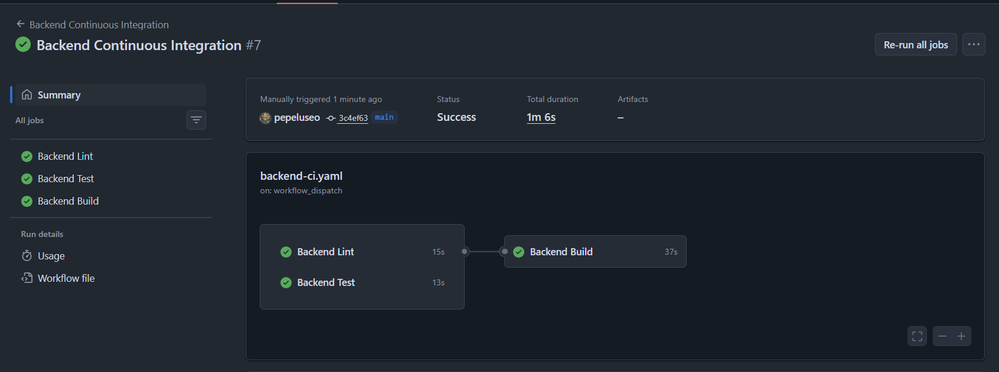
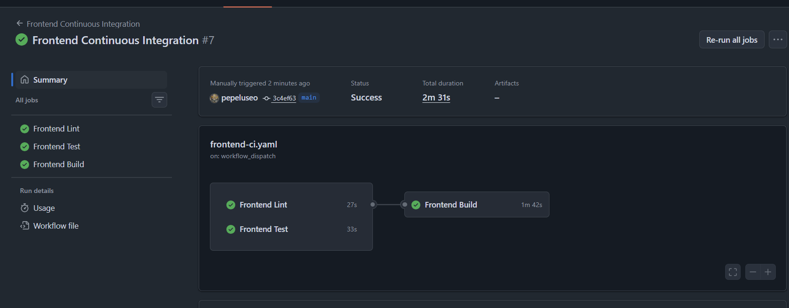
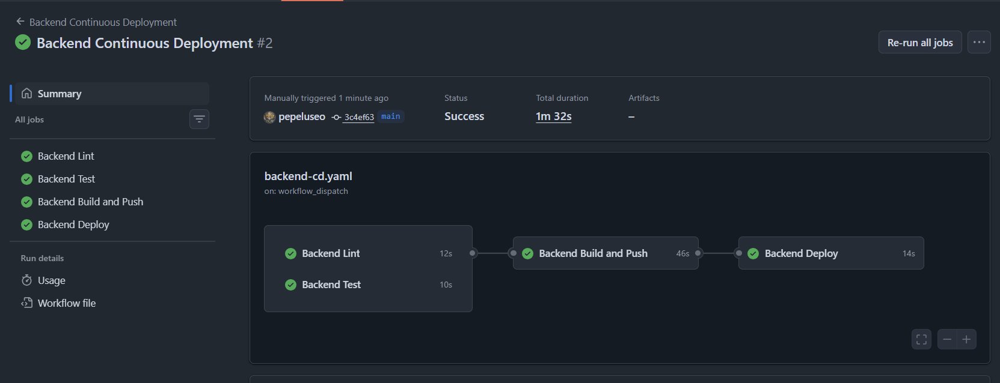
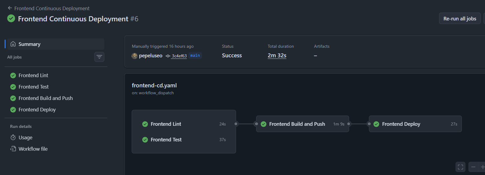
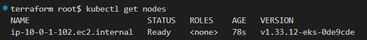
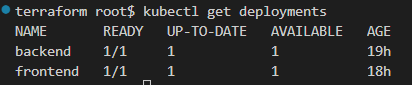
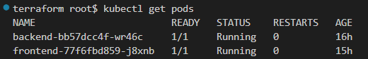
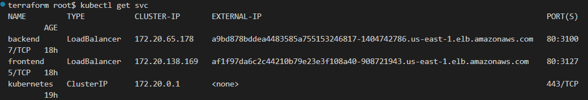
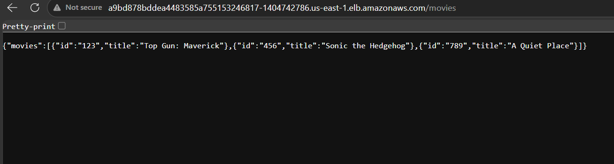
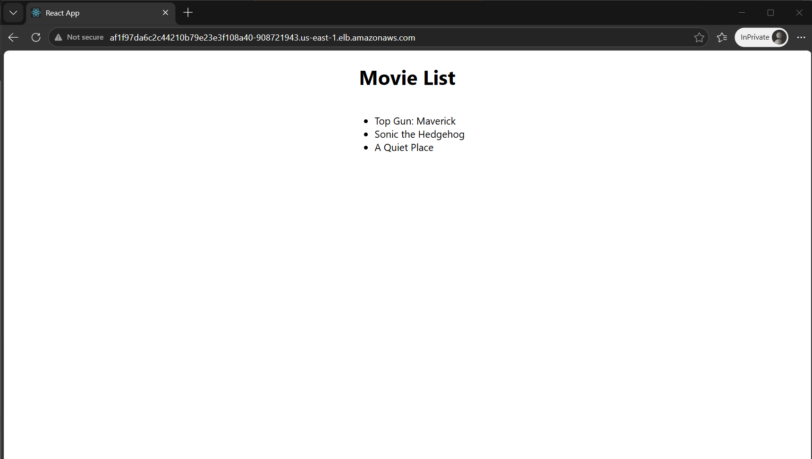

# Movie Picture Pipeline

A complete CI/CD pipeline project for a movie catalog web application composed of a React frontend and a Flask backend. The project automates linting, testing, Docker image builds, Amazon ECR pushes, and Kubernetes deployments to Amazon EKS using GitHub Actions.

---

## GitHub Repository

The project repository is available at:

[Movie Picture Pipeline GitHub Repository](https://github.com/pepeluseo/movie-picture-pipeline)


## GitHub Actions Verification Links

The following GitHub Actions workflow pages provide traceable evidence for the CI/CD implementation and successful workflow runs.

| Workflow | Purpose | Link |
|---|---|---|
| Frontend Continuous Integration | Lint, test, and build frontend on pull requests to `main` | [Frontend CI Workflow](https://github.com/pepeluseo/movie-picture-pipeline/actions/workflows/frontend-ci.yaml) |
| Backend Continuous Integration | Lint, test, and build backend on pull requests to `main` | [Backend CI Workflow](https://github.com/pepeluseo/movie-picture-pipeline/actions/workflows/backend-ci.yaml) |
| Frontend Continuous Deployment | Lint, test, build, push to ECR, and deploy frontend to EKS | [Frontend CD Workflow](https://github.com/pepeluseo/movie-picture-pipeline/actions/workflows/frontend-cd.yaml) |
| Backend Continuous Deployment | Lint, test, build, push to ECR, and deploy backend to EKS | [Backend CD Workflow](https://github.com/pepeluseo/movie-picture-pipeline/actions/workflows/backend)

## Table of Contents

- [Project Overview](#project-overview)
- [Architecture](#architecture)
- [Technology Stack](#technology-stack)
- [Repository Structure](#repository-structure)
- [CI/CD Workflows](#cicd-workflows)
- [Infrastructure](#infrastructure)
- [GitHub Secrets](#github-secrets)
- [Deployment Verification](#deployment-verification)
- [Application URLs](#application-urls)
- [Screenshots / Evidence](#screenshots--evidence)
- [Local Development](#local-development)
- [Troubleshooting Notes](#troubleshooting-notes)
- [Cleanup](#cleanup)
- [Author](#author)

---

## Security Remediation

A local AWS credential helper file was removed from the repository and added to `.gitignore`.

AWS credentials are not stored in the repository. Deployment credentials are managed through GitHub Actions Secrets or temporary shell environment variables.

Any exposed AWS access keys were rotated or revoked before resubmission.

## Project Overview

This project implements an automated CI/CD pipeline for a movie catalog application. The application consists of two independently deployed services:

- **Backend API**: A Python Flask service that exposes movie data through a `/movies` endpoint.
- **Frontend UI**: A React application that consumes the backend API and displays a movie list in the browser.

The pipeline validates application code, builds Docker images, pushes those images to Amazon ECR, and deploys the workloads to an Amazon EKS Kubernetes cluster.

---

## Architecture

The final deployed architecture includes:

```text
GitHub Repository
       |
       | GitHub Actions CI/CD
       v
Docker Build Jobs
       |
       v
Amazon ECR
       |
       v
Amazon EKS Cluster
       |
       +--> Backend Service  --> LoadBalancer --> /movies API
       |
       +--> Frontend Service --> LoadBalancer --> Movie List UI
```

### Runtime Flow

1. GitHub Actions builds and pushes backend and frontend Docker images to Amazon ECR.
2. Kubernetes deployments in Amazon EKS pull the images from ECR.
3. The backend is exposed using a Kubernetes `LoadBalancer` service.
4. The frontend is exposed using a Kubernetes `LoadBalancer` service.
5. The frontend calls the backend public API URL and renders the movie list.

---

## Technology Stack

| Area | Technology |
|---|---|
| Frontend | React |
| Backend | Python Flask |
| CI/CD | GitHub Actions |
| Containers | Docker |
| Container Registry | Amazon ECR |
| Orchestration | Amazon EKS / Kubernetes |
| Infrastructure as Code | Terraform |
| AWS CLI / kubectl | Deployment and verification |

---

## Repository Structure

```text
.
├── .github/
│   └── workflows/
│       ├── backend-ci.yaml
│       ├── backend-cd.yaml
│       ├── frontend-ci.yaml
│       └── frontend-cd.yaml
├── setup/
│   └── terraform/
│       ├── main.tf
│       ├── outputs.tf
│       ├── variables.tf
│       └── versions.tf
├── starter/
│   ├── backend/
│   │   ├── Dockerfile
│   │   ├── Pipfile
│   │   ├── Pipfile.lock
│   │   ├── k8s/
│   │   └── ...
│   └── frontend/
│       ├── Dockerfile
│       ├── package.json
│       ├── package-lock.json
│       ├── src/
│       ├── k8s/
│       └── ...
└── README.md
```

---

## CI/CD Workflows

The project contains four GitHub Actions workflows.

### Backend Continuous Integration

File:

```text
.github/workflows/backend-ci.yaml
```

Purpose:

- Runs on pull requests targeting `main`.
- Runs backend lint checks.
- Runs backend tests.
- Builds the backend Docker image after lint and tests pass.

Jobs:

```text
Backend Lint
Backend Test
Backend Build
```

### Frontend Continuous Integration

File:

```text
.github/workflows/frontend-ci.yaml
```

Purpose:

- Runs on pull requests targeting `main`.
- Runs frontend lint checks.
- Runs frontend tests.
- Builds the frontend Docker image after lint and tests pass.

Jobs:

```text
Frontend Lint
Frontend Test
Frontend Build
```

### Backend Continuous Deployment

File:

```text
.github/workflows/backend-cd.yaml
```

Purpose:

- Runs manually through `workflow_dispatch` and/or on changes to backend code.
- Runs backend lint and tests.
- Builds and tags the backend Docker image using the Git commit SHA.
- Pushes the image to Amazon ECR.
- Deploys the backend image to Amazon EKS.

Jobs:

```text
Backend Lint
Backend Test
Backend Build and Push
Backend Deploy
```

### Frontend Continuous Deployment

File:

```text
.github/workflows/frontend-cd.yaml
```

Purpose:

- Runs manually through `workflow_dispatch` and/or on changes to frontend code.
- Runs frontend lint and tests.
- Builds and tags the frontend Docker image using the Git commit SHA.
- Pushes the image to Amazon ECR.
- Deploys the frontend image to Amazon EKS.

Jobs:

```text
Frontend Lint
Frontend Test
Frontend Build and Push
Frontend Deploy
```

---

## Infrastructure

Infrastructure was provisioned using Terraform from:

```text
setup/terraform
```

Terraform created the following AWS resources:

- Amazon ECR repository for backend images.
- Amazon ECR repository for frontend images.
- Amazon EKS cluster.
- Managed EKS node group.
- VPC, subnets, route tables, and networking resources.
- IAM roles and users required by the deployment workflow.

### Terraform Outputs

The final Terraform outputs used during deployment were:

```text
backend_ecr = 980015696732.dkr.ecr.us-east-1.amazonaws.com/backend
cluster_name = cluster
cluster_version = 1.33
frontend_ecr = 980015696732.dkr.ecr.us-east-1.amazonaws.com/frontend
github_action_user_arn = arn:aws:iam::980015696732:user/github-action-user
```

---

## GitHub Secrets

The deployment workflows use GitHub repository secrets instead of hardcoded credentials.

Required secrets:

| Secret Name | Value |
|---|---|
| `AWS_ACCESS_KEY_ID` | AWS access key used by GitHub Actions |
| `AWS_SECRET_ACCESS_KEY` | AWS secret key used by GitHub Actions |
| `AWS_REGION` | `us-east-1` |
| `EKS_CLUSTER_NAME` | `cluster` |
| `BACKEND_ECR_REPOSITORY` | `backend` |
| `FRONTEND_ECR_REPOSITORY` | `frontend` |
| `REACT_APP_MOVIE_API_URL` | Backend LoadBalancer base URL |

Final frontend API value:

```text
REACT_APP_MOVIE_API_URL=http://a9bd878bddea4483585a755153246817-1404742786.us-east-1.elb.amazonaws.com
```

> No AWS credentials are stored in the repository.

---

## Deployment Verification

### Kubernetes Nodes

The EKS node group was successfully recovered and the node reached `Ready` state:

```text
ip-10-0-1-102.ec2.internal   Ready   <none>   v1.33.12-eks-0de9cde
```

### Backend API Verification

The backend LoadBalancer endpoint successfully returned movie data:

```bash
curl http://a9bd878bddea4483585a755153246817-1404742786.us-east-1.elb.amazonaws.com/movies
```

Expected response:

```json
{"movies":[{"id":"123","title":"Top Gun: Maverick"},{"id":"456","title":"Sonic the Hedgehog"},{"id":"789","title":"A Quiet Place"}]}
```

### Frontend Verification

The frontend LoadBalancer rendered the movie list in the browser:

```text
Movie List
- Top Gun: Maverick
- Sonic the Hedgehog
- A Quiet Place
```

---

## Application URLs

### Backend API

```text
http://a9bd878bddea4483585a755153246817-1404742786.us-east-1.elb.amazonaws.com/movies
```

### Frontend UI

```text
http://af1f97da6c2c44210b79e23e3f108a40-908721943.us-east-1.elb.amazonaws.com
```


Repository URL:
[Movie Picture Pipeline Repository](https://github.com/pepeluseo/movie-picture-pipeline)

GitHub Actions workflow verification:
- [Frontend CI Workflow](https://github.com/pepeluseo/movie-picture-pipeline/actions/workflows/frontend-ci.yaml)
- [Backend CI Workflow](https://github.com/pepeluseo/movie-picture-pipeline/actions/workflows/backend-ci.yaml)
- [Frontend CD Workflow](https://github.com/pepeluseo/movie-picture-pipeline/actions/workflows/frontend-cd.yaml)
- [Backend CD Workflow](https://github.com/pepeluseo/movie-picture-pipeline/actions/workflows/backend-cd.yaml)

Security remediation:
The setup/terraform/aws-creds.sh helper file was removed from the repository and added to .gitignore. The exposed AWS access keys were rotated/revoked. AWS credentials are now managed only through GitHub Actions Secrets or temporary shell environment variables.

Runtime evidence:
The repository includes screenshots for CI/CD runs, Kubernetes nodes, deployments, pods, LoadBalancer services, backend /movies response, and frontend movie list verification.


---

## Screenshots / Evidence

The following screenshots should be included with the project submission or stored in a `submission/` or `screenshots/` folder.

Recommended evidence list:

```text
screenshots/backend-ci-success.png
screenshots/frontend-ci-success.png
screenshots/backend-cd-success.png
screenshots/frontend-cd-success.png
screenshots/pods-running.png
screenshots/services-loadbalancer.png
screenshots/backend-api-working.png
screenshots/frontend-working.png
```

## Screenshots / Evidence

This section provides visual evidence of the successful CI/CD implementation, AWS deployment, Kubernetes runtime status, and final application verification.

---

### 1. Continuous Integration Evidence

The following screenshots show that both backend and frontend CI workflows completed successfully. These workflows validate linting, testing, and Docker build steps before code is integrated.

#### Backend CI Success



#### Frontend CI Success



---

### 2. Continuous Deployment Evidence

The following screenshots show that both backend and frontend CD workflows completed successfully. These workflows build Docker images, push them to Amazon ECR, and deploy the workloads to Amazon EKS.

#### Backend CD Success



#### Frontend CD Success



---

### 3. Kubernetes Cluster Evidence

The following screenshots verify that the Amazon EKS cluster was running correctly, with an active node, successful deployments, running pods, and exposed LoadBalancer services.

#### EKS Node Ready



#### Kubernetes Deployments Working



#### Backend and Frontend Pods Running



#### LoadBalancer Services



---

### 4. Application Verification Evidence

The following screenshots confirm that the deployed backend API and frontend UI are working correctly in the AWS environment.

#### Backend API Working

The backend `/movies` endpoint successfully returns the expected movie data in JSON format.



#### Frontend Application Working

The frontend application successfully renders the movie list retrieved from the backend API.



---

### Evidence Checklist

| Evidence | Status |
|---|---|
| Backend CI workflow completed successfully | ✅ |
| Frontend CI workflow completed successfully | ✅ |
| Backend CD workflow completed successfully | ✅ |
| Frontend CD workflow completed successfully | ✅ |
| EKS node reached `Ready` state | ✅ |
| Kubernetes deployments were created successfully | ✅ |
| Backend and frontend pods reached `Running` state | ✅ |
| Backend and frontend services were exposed through LoadBalancers | ✅ |
| Backend `/movies` endpoint returned the expected JSON response | ✅ |
| Frontend rendered the movie list successfully | ✅ |


---

## Local Development

### Backend

```bash
cd starter/backend
pipenv install
pipenv run lint
pipenv run test
pipenv run serve
```

Backend default local URL:

```text
http://localhost:5000/movies
```

### Frontend

```bash
cd starter/frontend
npm ci
npm run lint
npm test -- --watchAll=false
npm start
```

Frontend default local URL:

```text
http://localhost:3000
```

### Docker Build Examples

Backend:

```bash
cd starter/backend
docker build --tag mp-backend:latest .
```

Frontend:

```bash
cd starter/frontend
docker build --build-arg=REACT_APP_MOVIE_API_URL=http://localhost:5000 --tag mp-frontend:latest .
```

---

## Troubleshooting Notes

### Kubernetes version update

The original Terraform configuration used Kubernetes version `1.25`, which was no longer accepted for creating a new Amazon EKS cluster. The cluster version was updated to:

```text
1.33
```

### Amazon Linux AMI path update

The EKS optimized AMI lookup was updated from Amazon Linux 2 to Amazon Linux 2023:

```text
amazon-linux-2023/x86_64/standard
```

### ImagePullBackOff issue

The initial deployments attempted to pull images named only:

```text
backend
frontend
```

Kubernetes interpreted those as Docker Hub images:

```text
docker.io/library/backend:latest
docker.io/library/frontend:latest
```

The deployments were corrected to use full Amazon ECR image URIs:

```text
980015696732.dkr.ecr.us-east-1.amazonaws.com/backend:<commit-sha>
980015696732.dkr.ecr.us-east-1.amazonaws.com/frontend:<commit-sha>
```

### Frontend API URL issue

The frontend was initially compiled with:

```text
localhost:5000
```

For the deployed AWS environment, the frontend needed to be rebuilt with the backend LoadBalancer URL:

```text
http://a9bd878bddea4483585a755153246817-1404742786.us-east-1.elb.amazonaws.com
```

### Node group recovery

After the Udacity Workspace restarted, the EKS cluster existed but no Kubernetes nodes were visible. The node group was recovered by ensuring the node group access entry existed and allowing the Auto Scaling Group to recreate a fresh EC2 node.

---

## Cleanup

After all required screenshots are collected and the project has been submitted, destroy the AWS infrastructure to avoid unnecessary charges:

```bash
cd setup/terraform
terraform destroy
```

When prompted, type:

```text
yes
```

---

## Author

**Jose Luis Lazaro Contreras**

Project completed as part of a CI/CD and DevOps deployment workflow using GitHub Actions, Docker, Amazon ECR, Amazon EKS, Kubernetes, and Terraform.


# Movie Picture Pipeline

You've been brought on as the DevOps resource for a development team that manages a web application that is a catalog of Movie Picture movies. They're in dire need of automating their development workflows in hopes of accelerating their release cycle. They'd like to use Github Actions to automate testing, building and deploying their applications to an existing Kubernetes cluster.

The team's project is comprised of 2 application.

1. A frontend UI built written in Typescript, using the React framework
2. A backend API written in Python using the Flask framework.

In the `starter` folder, you'll find 2 folders, one named `frontend` and one named `backend`, where each application's source code is maintained. Your job is to use the team's [existing documentation](./starter/frontend/frontend-development-notes) and create CI/CD pipelines to meet the teams' needs.

## Deliverables

### Frontend

1. A Continuous Integration workflow that:
   1. Runs on `pull_requests` against the `main` branch,only when code in the frontend application changes.
   2. Is able to be run on-demand (i.e. manually without needing to push code)
   3. Runs the following jobs in parallel:
      1. Runs a linting job that fails if the code doesn't adhere to eslint rules
      2. Runs a test job that fails if the test suite doesn't pass
   4. Runs a build job only if the lint and test jobs pass and successfully builds the application
2. A Continuous Deployment workflow that:
   1. Runs on `push` against the `main` branch, only when code in the frontend application changes.
   2. Is able to be run on-demand (i.e. manually without needing to push code)
   3. Runs the same lint/test jobs as the Continuous Integration workflow
   4. Runs a build job only when the lint and test jobs pass
      1. The built docker image should be tagged with the git sha
   5. Runs a deploy job that applies the Kubernetes manifests to the provided cluster.
      1. The manifest should deploy the newly created tagged image
      2. The tag applied to the image should be the git SHA of the commit that triggered the build

### Backend

1. A Continuous Integration workflow that:
   1. Runs on `pull_requests` against the `main` branch,only when code in the frontend application changes.
   2. Is able to be run on-demand (i.e. manually without needing to push code)
   3. Runs the following jobs in parallel:
      1. Runs a linting job that fails if the code doesn't adhere to eslint rules
      2. Runs a test job that fails if the test suite doesn't pass
   4. Runs a build job only if the lint and test jobs pass and successfully builds the application
2. A Continuous Deployment workflow that:
   1. Runs on `push` against the `main` branch, only when code in the frontend application changes.
   2. Is able to be run on-demand (i.e. manually without needing to push code)
   3. Runs the same lint/test jobs as the Continuous Integration workflow
   4. Runs a build job only when the lint and test jobs pass
      1. The built docker image should be tagged with the git sha
   5. Runs a deploy job that applies the Kubernetes manifests to the provided cluster.
      1. The manifest should deploy the newly created tagged image
      2. The tag applied to the image should be the git SHA of the commit that triggered the build

**⚠️ NOTE**
Once you begin work on Continuous Deployment, you'll need to first setup the AWS and Kubernetes environment. Follow the [instructions below](#setting-up-continuous-deployment-environment)  instructions only when you're ready to start testing your deployments.

## Setting up Continuous Deployment environment

Only complete these steps once you've finished your Continuous Integration pipelines for the frontend and backend applications. This section is meant to create a Kubernetes environment for you to deploy the applications to and verify the deployment step.

First we need to prep the AWS account with the necessary infrastructure for deploying the frontend and backend applications. As the focus of this course is building the CI/CD pipelines, we won't be requiring you to setup all of the underlying AWS and Kubernetes infrastructure. This will be done for you with the provided Terraform and helper scripts. As there are costs associated with running this infrastucture, **REMEMBER** to destroy everything before stopping work. Everything can be recreated, and the pipeline work you'll be doing is all saved in this repository.

### Create AWS infrastructure with Terraform

1. Export your AWS credentials from the Cloud Gateway
2. Use the commands below to run the Terraform and type `yes` after reviewing the expected changes

```bash
cd setup/terraform
terraform apply
```

4. Take note of the Terraform outputs. You'll need these later as you work on the project. You can always retrieve these values later with this command

```bash
cd setup/terraform
terraform output
```

### Generate AWS access keys for Github Actions

1. Once everything is created, you'll need to generate AWS credentials for the IAM user account that Github Actions will use in order to interact with your AWS account.
2. Launch the Cloud Gateway and go to the IAM service.
3. Under users, you should only see the `github-action-user` user account
4. Click the account and go to `Security Credentials`
5. Under `Access keys`  select `Create access key`
6. Select `Application running outside AWS` and click `Next`, then `Create access key` to finish creating the keys
7. On the last page, make sure to copy/paste these keys for storing in Github Secrets


### Add Github Action user to Kubernetes

Now that the cluster and all AWS resources have been created, you'll need to add the `github-action-user` IAM user ARN to the Kubernetes configuration that will allow that user to execute `kubectl` commands against the cluster.

1. Run the `init.sh` helper script in the `setup` folder

```bash
cd setup
./init.sh
```

2. The script will download a tool, add the IAM user ARN to the authentication configuration, indicate a `Done` status, then it'll remove the tool

## Dependencies

We've provided the below list of dependencies to assist in the case you'd like to run any of the work locally. Local development issues, however, are not supported as we cannot control the environment as we can in the online workspace.

All of the tools below will be available in the workspace

* [docker](https://docs.docker.com/desktop/install/debian/) - Used to build the frontend and backend applications
* [kubectl](https://kubernetes.io/docs/tasks/tools/) - Used to apply the kubernetes manifests
* [pipenv](https://pipenv.pypa.io/en/latest/install/#pragmatic-installation-of-pipenv) - Used for mananging Python version and dependencies
* [nvm](https://github.com/nvm-sh/nvm#installing-and-updating) - Used for managing NodeJS versions
* [tfswitch](https://tfswitch.warrensbox.com/Install/) Used for managing Terraform versions
* [kustomize](https://kubectl.docs.kubernetes.io/installation/kustomize/) Used for building the Kubernetes manifests dynamically in the CI environment
* [jq](https://stedolan.github.io/jq/download/) for parsing JSON more easily on the command line

## Frontend Development notes

### Running tests

While in the frontend directory, perform the following steps:

```bash
# Use correct NodeJS version
nvm use

# Install dependencies
npm ci

# Run the tests interactively. You'll need to press `a` to run the tests
npm test

# OR simulate running the tests in a CI environment
CI=true npm test


# Expected output
PASS src/components/__tests__/MovieList.test.js
PASS src/components/__tests__/App.test.js

Test Suites: 2 passed, 2 total
Tests:       3 passed, 3 total
Snapshots:   0 total
Time:        1.33 s
Ran all test suites.
```

To simulate a failure in the test coverage, which will be needed to ensure your CI/CD pipeline fails on bad tests, set the MOVIE_HEADING variable before the command like so:

```bash
FAIL_TEST=true CI=true npm test
```

As the test is expecting the heading to contain a certain value, we can simulate a failure by changing it with an inline or environment variable. If you use the environment variable, make sure to unset it when you're done testing

```bash
# Expect tests to fail with this set to anything except Movie List
export FAIL_TEST=true
CI=true npm test

# Expect tests to be passing again
unset MOVIE_HEADING
CI=true npm test
```

```bash
# Expected failure output
FAIL src/components/__tests__/App.test.js
  ● renders Movie List heading

    TestingLibraryElementError: Unable to find an element with the text: messed_up. This could be because the text is broken up by multiple elements. In this case, you can provide a function for your text matcher to make your matcher more flexible.

    Ignored nodes: comments, script, style
    <body>
      <div>
        <div>
          <h1>
            Movie List
          </h1>
          <ul />
        </div>
      </div>
    </body>

       8 | test('renders Movie List heading', () => {
       9 |   render(<App />);
    > 10 |   const linkElement = screen.getByText(movieHeading);
         |                              ^
      11 |   expect(linkElement).toBeInTheDocument();
      12 | });
      13 |

      at Object.getElementError (node_modules/@testing-library/react/node_modules/@testing-library/dom/dist/config.js:37:19)
      at allQuery (node_modules/@testing-library/react/node_modules/@testing-library/dom/dist/query-helpers.js:76:38)
      at query (node_modules/@testing-library/react/node_modules/@testing-library/dom/dist/query-helpers.js:52:17)
      at getByText (node_modules/@testing-library/react/node_modules/@testing-library/dom/dist/query-helpers.js:95:19)
      at Object.<anonymous> (src/components/__tests__/App.test.js:10:30)

PASS src/components/__tests__/MovieList.test.js
```

### Running linter

When there are no linting errors, the output won't return any errors

```bash
npm run lint

# Expected output
> frontend@1.0.0 lint
> eslint .
```

To simulate linting errors, you can run the linting command like so:

```bash
FAIL_LINT=true npm run lint

# Expected output
> frontend@1.0.0 lint
> eslint .


/home/kirby/udacity/ci-cd/project/solution/frontend/src/components/MovieDetails.js
  4:24  error  'movie' is missing in props validation     react/prop-types
  7:70  error  'movie.id' is missing in props validation  react/prop-types

✖ 2 problems (2 errors, 0 warnings)
```

### Build and run

For local development without docker, the developers use the following commands:

```bash
cd starter/frontend

# Install dependencies
npm ci

# Run local development server with hot reloading and point to the backend default
REACT_APP_MOVIE_API_URL=http://localhost:5000 npm start
```

To build the frontend application for a production deployment, they use the following commands:

```bash
# Build the image
# NOTE: Make sure the image is built with the URL of the backend system.
# The URL below would be the default backend URL when running locally
docker build --build-arg=REACT_APP_MOVIE_API_URL=http://localhost:5000 --tag=mp-frontend:latest .

docker run --name mp-frontend -p 3000:3000 -d mp-frontend]

# Open the browser to localhost:3000 and you should see the list of movies,
# provided the backend is already running and available on localhost:5000
```

### Deploy Kubernetes manifests

In order to build the Kubernetes manifests correctly, the team uses `kustomize` in the following way:

```bash
cd starter/frontend/k8s
# Make sure you're kubeconfig is configured for the EKS cluster, i.e.
# aws eks update-kubeconfig

# Set the image tag to the newer version
# ℹ️ Don't commit any changes to the manifests that this command introduces
kustomize edit set image frontend=<ECR_REPO_URL>:<NEW_TAG_HERE>

# Apply the manifests to the cluster
kustomize build | kubectl apply -f -
```

## Backend Development notes

### Running tests

While in the backend directory, perform the following steps:

```bash
# Install dependencies
pipenv install

# Run the tests
pipenv run test

# Expected output
================================================================== test session starts ==================================================================
platform linux -- Python 3.10.6, pytest-7.2.1, pluggy-1.0.0 -- /home/kirby/.local/share/virtualenvs/backend-AXGg_iGk/bin/python
cachedir: .pytest_cache
rootdir: /home/kirby/udacity/cd12354-build-ci-cd-pipelines-monitoring-and-logging/project/solution/backend
collected 3 items

test_app.py::test_movies_endpoint_returns_200 PASSED                                                                                              [ 33%]
test_app.py::test_movies_endpoint_returns_json PASSED                                                                                             [ 66%]
test_app.py::test_movies_endpoint_returns_valid_data PASSED                                                                                       [100%]
```

To simulate failing the backend tests, run the following command:

```bash
FAIL_TEST=true pipenv run test

# Expected output
==================================================================== test session starts ====================================================================
platform linux -- Python 3.10.6, pytest-7.2.1, pluggy-1.0.0 -- /home/kirby/.local/share/virtualenvs/backend-AXGg_iGk/bin/python
cachedir: .pytest_cache
rootdir: /home/kirby/udacity/ci-cd/project/solution/backend
collected 3 items

test_app.py::test_movies_endpoint_returns_200 FAILED                                                                                                  [ 33%]
test_app.py::test_movies_endpoint_returns_json PASSED                                                                                                 [ 66%]
test_app.py::test_movies_endpoint_returns_valid_data PASSED                                                                                           [100%]

========================================================================= FAILURES ==========================================================================
_____________________________________________________________ test_movies_endpoint_returns_200 ______________________________________________________________

    def test_movies_endpoint_returns_200():
        with app.test_client() as client:
            status_code = os.getenv("FAIL_TEST", 200)
            response = client.get("/movies/")
>           assert response.status_code == status_code
E           AssertionError: assert 200 == 'true'
E            +  where 200 = <WrapperTestResponse streamed [200 OK]>.status_code

test_app.py:9: AssertionError
================================================================== short test summary info ==================================================================
FAILED test_app.py::test_movies_endpoint_returns_200 - AssertionError: assert 200 == 'true'
================================================================ 1 failed, 2 passed in 0.11s ================================================================
```

### Running linter

When there are no linting errors, there won't be any output.

```bash
pipenv run lint
# No output
```

To simulate linting errors, you can run the linting command below. The command overrides our lint configuration and will error if any lines are over 88 characters.

```bash
pipenv run lint-fail

# Expected output
./movies/__init__.py:7:89: E501 line too long (120 > 88 characters)
./movies/__init__.py:9:89: E501 line too long (101 > 88 characters)
./movies/movies_api.py:7:89: E501 line too long (120 > 88 characters)
./movies/movies_api.py:9:89: E501 line too long (101 > 88 characters)
./movies/resources.py:16:89: E501 line too long (117 > 88 characters)
```

### Build and run

For local development without docker, the developers use the following commands to build and run the backend application:

```bash
cd starter/backend

# Install dependencies
pipenv install

# Run application
pipenv run serve
```

For production deployments, the team uses the following commands to build and run the Docker image.

```bash
cd starter/backend

# Build the image
docker build --tag mp-backend:latest .

# Run the image
docker run -p 5000:5000 --name mp-backend -d mp-backend

# Check the running application
curl http://localhost:5000/movies

# Review logs
docker logs -f mp-backend

# Expected output
{"movies":[{"id":"123","title":"Top Gun: Maverick"},{"id":"456","title":"Sonic the Hedgehog"},{"id":"789","title":"A Quiet Place"}]}

# Stop the application
docker stop
```

### Deploy Kubernetes manifests

In order to build the Kubernetes manifests correctly, the team uses `kustomize` in the following way:

```bash
cd starter/backend/k8s
# Make sure you're kubeconfig is configured for the EKS cluster, i.e.
# aws eks update-kubeconfig

# Set the image tag to the newer version
# ℹ️ Don't commit any changes to the manifests that this command introduces
kustomize edit set image backend=<ECR_REPO_URL>:<NEW_TAG_HERE>

# Apply the manifests to the cluster
kustomize build | kubectl apply -f -
```

## License

[License](LICENSE.md)
